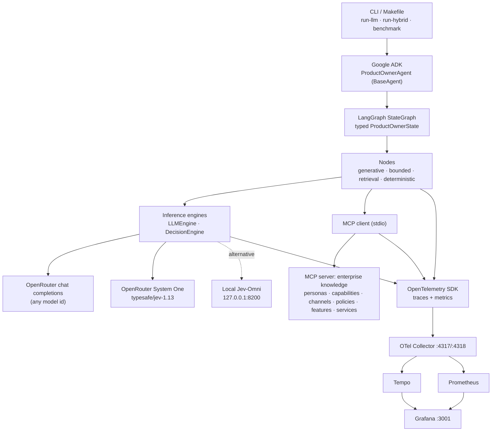

# Architecture

An experiment that measures what changes when the **bounded decisions** inside an agentic
Product Owner workflow move from an LLM to **Jev** (TypeSafe's System One decision model),
while the genuinely generative steps stay on an LLM.

Two variants of one graph run against the same intent document:

| Variant | Generative nodes | Bounded nodes |
|---|---|---|
| `llm` (baseline) | LLM | LLM, answering the *same typed questions* through a strict JSON schema |
| `hybrid` | LLM | Jev (`POST /v1/systemone`) |

Everything else is identical: topology, prompts, question text, MCP knowledge, thresholds, retry
policy and telemetry. The only variable is the engine behind the bounded nodes.

## Layers



Boundaries, and what each layer may know about:

| Layer | Module | Knows about | Must not know about |
|---|---|---|---|
| Application | `po_agent/adk_app.py`, `po_agent/cli.py` | ADK sessions, experiment directories | prompts, model SDKs |
| Orchestration | `po_agent/runner.py`, `po_agent/benchmark.py` | variants, repeated runs, result files | node internals |
| Graph | `po_agent/graph/build.py` | nodes, edges, gates, loop caps | engines' HTTP details |
| Nodes | `po_agent/graph/nodes.py`, `questions.py`, `prompts/*.md` | state, engine *protocols*, MCP *protocol* | which vendor serves the engine |
| Engines | `po_agent/engines/*` | HTTP, retries, token usage, cost | graph state |
| Knowledge | `po_agent/knowledge/*` | MCP tools and the catalogue data | engines |
| Telemetry | `po_agent/telemetry.py` | span and metric names | everything else |

## The equivalence trick: typed questions on both sides

Every bounded node is written once, as a set of **System One questions** (`noul`, `choice`,
`score`) plus a deterministic policy that turns probabilities into a decision. The node asks a
`DecisionEngine` and never knows which one it got:

- `JevEngine` posts the questions to `/v1/systemone`.
- `LLMDecisionEngine` renders the *same* state and questions into one prompt and requires the LLM
  to return the *same* answer shape (probability per option, via a strict JSON schema), then
  normalises it. Confidence is computed with the same formula as Jev's (`1 − H(p)/ln K`).

So the baseline is not "an LLM doing something vaguely similar"; it is the LLM asked exactly the
question Jev is asked, with the same thresholds applied afterwards. Any difference in latency,
cost, consistency or downstream quality is attributable to the engine.

## Telemetry design

One trace per graph execution:

```text
ProductOwner.Run                       experiment.id run.id workflow.variant
├── parse_intent                       graph.node.* engine.type=llm
│     └── inference.llm                model.name input.tokens output.tokens total.cost latency
├── retrieve_knowledge
│     ├── mcp.call get_capabilities    mcp.server mcp.tool result_count
│     ├── mcp.call get_channels
│     └── mcp.call get_personas
├── select_capabilities                engine.type=jev|llm
│     └── inference.jev | inference.llm
├── select_personas
│     └── inference.*
├── identify_outcomes
├── retrieve_constraints
│     └── mcp.call ×3
├── assess_constraints
├── discover_risks
├── assess_risks                       graph.node.attempt=1
├── investigate_risks                  (only when the gate fires)
├── assess_risks                       graph.node.attempt=2
├── generate_requirements
├── classify_requirements
├── check_coverage
├── refine_requirements                (only when coverage is insufficient)
├── construct_prd
├── validate_prd
├── refine_prd                         (only when validation fails)
└── finalise
```

Metrics (OTLP → Prometheus), labelled only with low-cardinality dimensions
(`workflow.variant`, `graph.node.name`, `engine.type`, `model.name`, `status`):

| Metric | Type | What |
|---|---|---|
| `po.node.duration` | histogram (ms) | wall time per node execution |
| `po.inference.duration` | histogram (ms) | one engine call |
| `po.inference.calls` | counter | engine calls, by engine/model/status |
| `po.inference.tokens` | counter | tokens by `direction` = input/output |
| `po.inference.cost` | counter (USD) | reported or catalogue cost |
| `po.inference.retries` | counter | retries by reason |
| `po.mcp.duration` | histogram (ms) | one MCP tool call |
| `po.run.duration` | histogram (ms) | whole workflow |
| `po.run.outcome` | counter | success/failure per variant |

Run ids, prompts, documents and intermediate outputs go into span attributes/events (Tempo) and the
results directory, never into metric labels. Nothing from the catalogue is sent to telemetry except
ids and counts.

## Experiment outputs

```text
results/<experiment-id>/
  intent.md            the input, copied
  config.yaml          effective configuration (models, thresholds, endpoints; no secrets)
  pricing.yaml         the pricing catalogue used
  llm/
    run-01/ … run-NN/  prd.md · metrics.json · node-results.json · trace-id
  hybrid/
    run-01/ … run-NN/
  evaluation/
    quality.json       blind A/B rubric judgements, raw, with the A/B mapping
    consistency.json   bounded nodes replayed on fixed inputs, per engine
  comparison.json
  comparison.md
```

`node-results.json` holds, per node execution: inputs hash, outputs (canonicalised), engine,
model, tokens, cost, latency, attempt, trace/span ids. The consistency experiment and the Grafana
drill-down are both built from it.

## What is deliberately not here

- No vector store or RAG: the catalogue is small and authoritative, so MCP returns it whole and the
  graph decides what applies.
- No streaming: the nodes need complete structured outputs; time-to-first-token is captured only
  where the provider reports it.
- No prompt caching tricks: both variants send the same prompts, so caching would move the result
  equally for both; it is left off so numbers are comparable across providers.
