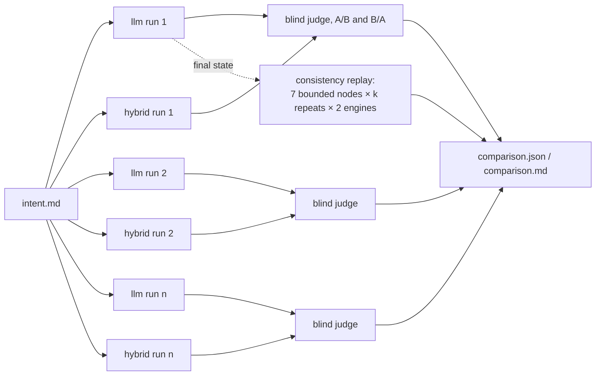

# Benchmark method

`make benchmark INTENT=<file> RUNS=<n>` runs both variants `n` times on the same intent and
writes `results/<experiment-id>/`. Nothing in the report is estimated; every number is a
measurement from a run directory, and a cost that could not be measured or priced is reported as
`unknown`.

## What one experiment does

1. **Runs are interleaved** (llm, hybrid, hybrid, llm, ...) so provider conditions are shared
   fairly between variants.
2. **Each run is one OpenTelemetry trace** (`ProductOwner.Run`, attribute `run.id`), with one
   span per node execution and one child span per engine or MCP call. The trace id is saved in
   the run directory.
3. **Quality** is judged blind, per pair of runs, by a separate model that sees the intent, PRD A,
   PRD B and the rubric, and not which variant wrote which. Each pair is judged twice with the
   order swapped (`benchmark.judge_both_orders`) so position bias cancels. Raw judgements and
   the A/B mapping are kept in `evaluation/quality.json`.
4. **Consistency** replays every bounded node on one fixed input (the final state of the first
   successful run) `k` times with each engine, and compares the *decisions* (booleans and labels
   after thresholds), not the probabilities. Two numbers per node and engine:
   - `identical_rate`: share of repeats whose complete decision set equals the modal one;
   - `decision_agreement`: mean share of repeats agreeing with the mode, per individual decision.
5. **Statistics** are reported as median, p95, min, max and variance across runs; the report
   never shows only a mean.

## What is measured where

| Measure | Source | Granularity |
|---|---|---|
| Latency | `time.perf_counter()` around each node and each engine call | node, engine call, run |
| Tokens | the provider's `usage` (OpenRouter chat and System One both report it) | engine call, aggregated to node and run |
| Cost | `usage.cost` as reported by OpenRouter, else `config/pricing.yaml`, else unknown | engine call, aggregated |
| Calls, retries, errors | engine wrappers | engine call |
| Loop counts | `graph.node.attempt` on spans; `loops` in `metrics.json` | run |
| Quality | blind judge, 10 rubric dimensions × 1–5 | pair of runs |
| Consistency | replay | bounded node × engine |

Objective measures (latency, tokens, cost, calls) and subjective ones (quality) come from
different code paths and are never combined into a single score.

## What keeps the comparison honest

- Same graph, prompts, questions, thresholds, MCP data and retry policy for both variants.
- The baseline is given the *same typed questions* Jev gets, with a strict answer schema, so the
  only difference at a bounded node is the engine (see [engine selection](engine-selection.md)).
- The judge model is not one of the models under test.
- Thresholds and loop caps are recorded in every result's `config.yaml`; the pricing table is
  snapshotted as `pricing.yaml`.
- Failed runs count towards the failure rate and are kept, with the failing node recorded.

## Reading `comparison.md`

The header table is the run-level comparison. The node-level table shows where any difference
came from. The consistency table shows per bounded node how stable each engine's decisions were
on identical input. The quality table shows mean rubric scores per dimension and how often the
judge preferred each variant.
