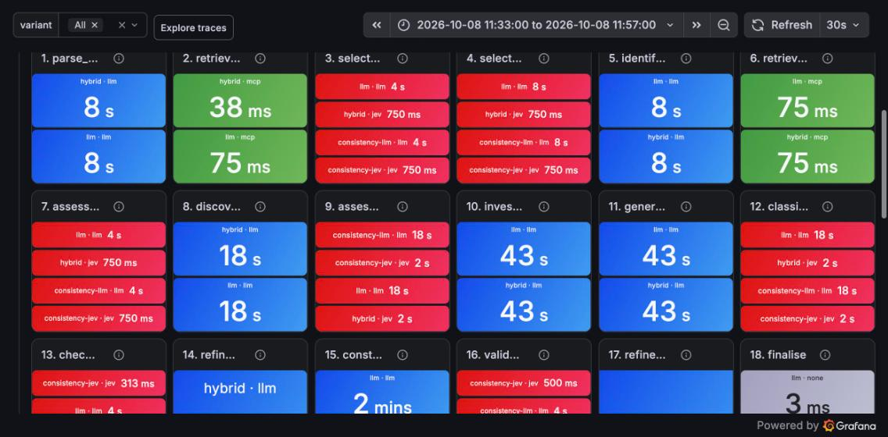

# Executive summary: what Jev changed in a Product Owner agent

*Experiment `20261008-113335-6db897`, 8 October 2026. One intent document ("self-service delivery
rescheduling"), one 18-node Product Owner workflow, run two ways on identical prompts, knowledge
and thresholds. Every figure below is a measurement from that experiment; nothing is estimated.*

## The question

An agentic Product Owner turns an intent document into a PRD through 18 steps. Eight of those
steps write text (an LLM has to do them). Seven are **bounded decisions**: which personas are
affected, which policies apply, how severe each risk is, which requirements are must-haves,
whether the PRD passes a checklist. The experiment replaced the LLM with **Jev** (TypeSafe's
System One decision model, served through OpenRouter) on exactly those seven steps and measured
what changed.

## Headline numbers

| | **LLM only** (Claude Haiku 4.5 everywhere) | **Hybrid** (Haiku writes, Jev 1.13 decides) | Delta |
|---|---|---|---|
| End-to-end time for one PRD | 284 s | 235 s | **−17 %** |
| Cost for one PRD | $0.307 | $0.194 | **−37 %** |
| Time spent in the seven bounded steps (sum of per-step medians) | 67.2 s | 6.4 s | **−91 %** |
| Cost of the seven bounded steps (sum of per-step medians) | $0.125 | $0.003 | **−98 %** |
| Model calls | 27 LLM | 8 LLM + 35 Jev | |
| Decision consistency on identical input (3 replays) | 100 % of decisions reproduced | 98.0 % of decisions reproduced | LLM ahead |
| PRD quality, blind judge, mean of two orderings (out of 50) | 46.5 | 40.0 | LLM ahead |

Jev did what it was supposed to do on the steps it was given: each bounded decision became
**5–16× faster** and **35–60× cheaper**, with no errors or retries in 35 calls. The remaining
cost and time of the hybrid run are almost entirely the generative steps (writing the PRD alone
is $0.07–0.08 and 90–100 s), which Jev cannot do and was never asked to do.

*Red = bounded decision nodes (LLM in the baseline, Jev in the hybrid), blue = generative, green =
MCP retrieval. Each tile shows the median latency per execution for each variant.*

## Where the saving came from, step by step

Median per execution over three executions of each step (one complete run plus two runs that
completed these steps before failing later on an unrelated bug, fixed before the final run).

| Bounded step | LLM latency | Jev latency | LLM cost | Jev cost |
|---|---|---|---|---|
| Select capabilities and channels | 4.4 s | 1.0 s | $0.0055 | $0.00009 |
| Select personas and rate impact | 7.7 s | 0.6 s | $0.0105 | $0.00015 |
| Assess which policies/features apply | 4.8 s | 0.6 s | $0.0059 | $0.00010 |
| Classify, score and prioritise 12 risks | 22.2 s | 1.4 s | $0.0351 | $0.00062 |
| Classify and prioritise 18–22 requirements | 21.5 s | 1.7 s | $0.0322 | $0.00066 |
| Check coverage of outcomes and goals | 2.7 s | 0.3 s | $0.0048 | $0.00010 |
| Validate the PRD against ten checks | 3.9 s | 0.8 s | $0.0310 | $0.00120 |

The generative steps were the same in both variants (parse intent ~6–7 s, discover risks ~16 s,
generate requirements ~42 s, write PRD ~90–100 s) and now dominate the run: in the hybrid, the
LLM accounts for 223 s of the 235 s and $0.189 of the $0.194.

## Determinism: measured, and not what we expected

Each bounded step was replayed three times on the same frozen input with each engine, and the
*decisions* (after thresholds) were compared.

- **The LLM at temperature 0 reproduced every decision, on every step, every time** (100 %).
  OpenRouter routed every replay to the same provider, and Haiku's probabilities are coarse
  (0.1, 0.9), so nothing sits near a threshold.
- **Jev reproduced 98.0 % of decisions.** Its probabilities vary slightly call to call (we saw
  0.48 → 0.49 on the same question), so the handful of decisions that sit at a threshold flip:
  one persona's impact rated *low* twice and *medium* once; one policy judged applicable once in
  three; two requirements *must* twice and *should* once; one coverage check at P = 0.48/0.49
  against a 0.5 threshold. Three steps were perfectly stable; four had one to three flips each.

So, on this evidence, **Jev is not more deterministic than a temperature-0 LLM for these
decisions; it is slightly less.** What Jev does give is a calibrated probability and a
confidence per decision, which makes the instability visible and fixable: a 0.48 is a 0.48, and
policy code can treat anything within ±0.05 of a threshold as "unsure, ask or default" rather
than flipping. The LLM's 0.9 offers no such signal. That is a design lever, not a free property.

## Quality: the baseline PRD was judged better, and the trail shows why

A separate model (Claude Sonnet 5) judged the two PRDs blind, twice with the order swapped, on a
ten-point rubric. It preferred the LLM-only PRD both times (48–38 and 45–42). The gap was on
*unsupported assumptions*, *internal consistency* and *intent fidelity*; on risk coverage and
completeness the two were equal.

The telemetry explains the gap, and it is upstream of the writing:

1. Jev selected **six** impacted personas (adding a marketing manager and a finance analyst);
   the LLM selected four. Those two personas pulled finance and marketing requirements and
   outcomes into the PRD that the intent never asked for, which the judge marked down as
   scope creep and invented figures.
2. The hybrid's coverage check sent the requirement set round the refinement loop **three
   times** (the LLM's once), ending with 22 requirements against 18 and a longer PRD.
3. Jev's own PRD validation **flagged exactly the weaknesses the judge found** (unsupported
   assumptions, internal consistency, actionability) but, under the current policy, those three
   checks are non-blocking, so no rewrite was triggered. The LLM validator passed everything.

In other words, the quality difference comes from two threshold decisions (persona selection
at P ≥ 0.5, and which validation checks block), both of which are configuration, and Jev's
probabilities are precisely the information needed to tune them.

## What this does and does not show

- **Shown:** on bounded decisions inside this workflow, Jev cut latency by about 90 % and cost
  by about 98 % versus the same decisions on an LLM, with zero failures, and shortened the whole
  run by 17 % and its cost by 37 % even though the hybrid did more work (more loop iterations).
- **Shown:** Jev's validation signal agreed with an independent judge where the LLM's did not.
- **Not shown:** that Jev is more deterministic than a temperature-0 LLM (it measured slightly
  less), or that the hybrid PRD is as good (it was judged worse, for traceable, tunable reasons).
- **Limits:** one intent, one complete run per variant (node-level figures use three executions
  per step), a $5 API budget, one judge model. Run-to-run variance of the whole workflow is not
  yet measured; `make benchmark RUNS=5` on a larger budget gives distributions for every row above.

## Recommended next steps

1. Gate near-threshold Jev decisions with its confidence (treat |P − threshold| < 0.05 as
   "unsure") and make the three failed validation checks blocking; re-run and re-judge.
2. Raise the OpenRouter limit and run `RUNS=5` on the two bundled intents to get p95 and variance.
3. Try a stronger writer (Sonnet 5) for `construct_prd` only; it is now 40 % of the hybrid's
   time and cost, and Jev's savings make room for it at the same total price.

*Reproduce: `make benchmark INTENT=examples/example-intent.md RUNS=1`; raw results, PRDs, per-node
records, judgements and trace ids are in `results/<experiment-id>/`. Traces are in Tempo under
service `product-owner-agent-demo`; the Grafana board is `po-benchmark`.*
