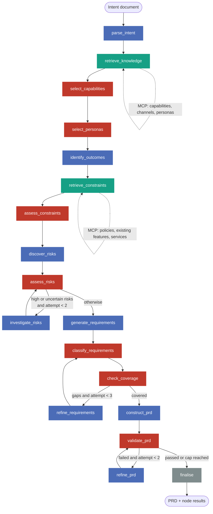

# The Product Owner graph

## Diagram

Blue = generative (LLM in both variants). Red = bounded (LLM in baseline, Jev in hybrid).
Green = retrieval over MCP. Grey = deterministic.

Three loops, each with a hard cap so a run always terminates:

| Gate | Fires when | Loop | Cap |
|---|---|---|---|
| after `assess_risks` | any risk with `needs_investigation ≥ 0.6` or priority ≥ 12 | `investigate_risks` → `assess_risks` | 1 investigation (attempt 2 is final) |
| after `check_coverage` | any persona, outcome or goal without a must/should requirement | `refine_requirements` → `classify_requirements` | 2 refinements |
| after `validate_prd` | any validation noul < 0.6 | `refine_prd` → `validate_prd` | 1 refinement |

## Node table

Types: **G** generative/open-ended · **B** bounded decision (selection, classification, scoring,
validation) · **R** external retrieval · **D** deterministic computation.

| # | Node | Responsibility | Input (from state) | Output (to state) | Type | Baseline | Hybrid | MCP | Telemetry | Why this engine |
|---|---|---|---|---|---|---|---|---|---|---|
| 1 | `parse_intent` | Turn the raw intent document into a structured brief: title, summary, goals, in/out of scope, actors mentioned, stated assumptions, success signals | `intent_text` | `brief` | G | LLM | LLM | – | node span, `inference.llm` | Open-ended extraction and summarisation; no fixed option set. |
| 2 | `retrieve_knowledge` | Fetch the canonical capability, channel and persona catalogues | – | `catalogue.capabilities`, `.channels`, `.personas` | R | – | – | `get_capabilities`, `get_channels`, `get_personas` | node span, 3 × `mcp.call` | Authoritative data must come from the enterprise, not the model. |
| 3 | `select_capabilities` | Decide which catalogue capabilities and channels the intent touches | `brief`, `catalogue.capabilities`, `.channels` | `selected_capabilities`, `selected_channels` | B (selection) | LLM via typed questions | Jev | – | node span, `inference.*`, `decision.count` | One `noul` per catalogue entry against a fixed state: a closed yes/no with a known option set. The canonical bounded decision. |
| 4 | `select_personas` | Pick impacted personas and rate the impact | `brief`, `selected_capabilities`, `catalogue.personas` | `selected_personas` (with impact 0–3 and probabilities) | B (selection + scoring) | LLM via typed questions | Jev | – | as above | Closed set, two typed questions per persona (`noul` impacted, `score` impact). |
| 5 | `identify_outcomes` | Articulate user and business outcomes with measurable signals | `brief`, `selected_personas` | `outcomes` | G | LLM | LLM | – | node span, `inference.llm` | Requires synthesis and wording; no enumerable answer space. |
| 6 | `retrieve_constraints` | Fetch policies, existing features and services relevant to the selected capabilities | `selected_capabilities` | `catalogue.policies`, `.features`, `.services` | R | – | – | `search_policies`, `get_existing_features`, `get_services` | node span, 3 × `mcp.call` | Retrieval keyed by ids chosen upstream; deterministic. |
| 7 | `assess_constraints` | Decide which retrieved policies actually apply and whether an existing feature already covers part of the intent | `brief`, `catalogue.policies`, `.features` | `applicable_policies`, `overlapping_features` | B (classification) | LLM via typed questions | Jev | – | node span, `inference.*` | Applicability of a known policy to a known brief is a closed question. |
| 8 | `discover_risks` | Enumerate risks: delivery, adoption, security, privacy, compliance, operational, financial | `brief`, `selected_personas`, `applicable_policies`, `catalogue.services` | `risks` (unassessed) | G | LLM | LLM | – | node span, `inference.llm` | Open-ended discovery; the value is in finding what nobody listed. |
| 9 | `assess_risks` | Classify, score and prioritise each risk; flag which need investigation | `brief`, `risks` | `risks` (category, likelihood, impact, priority, needs_investigation), `risk_attempt` | B (classification + scoring) | LLM via typed questions | Jev | – | node span, `inference.*`, `graph.node.attempt` | Fixed category set, fixed 1–5 scales, yes/no investigation flag. Priority = likelihood × impact is computed in code. |
| 10 | `investigate_risks` | For flagged risks, propose mitigations, restate the risk with what is now known | `risks` (flagged), `brief`, `catalogue.services` | `risks` (mitigation, revised description) | G | LLM | LLM | – | node span, `inference.llm` | Mitigation writing is generative. |
| 11 | `generate_requirements` | Draft candidate requirements linked to personas, outcomes and risks | `brief`, `selected_personas`, `outcomes`, `risks`, `applicable_policies`, `overlapping_features` | `requirements` (unclassified) | G | LLM | LLM | – | node span, `inference.llm` | Ideation. |
| 12 | `classify_requirements` | Type each requirement, assign MoSCoW, flag duplicates of existing features | `requirements`, `overlapping_features`, `brief` | `requirements` (kind, moscow, duplicate_of_feature), `requirement_attempt` | B (classification + prioritisation) | LLM via typed questions | Jev | – | node span, `inference.*` | Two `choice` questions and one `noul` per requirement over fixed sets. Final ordering (MoSCoW, then outcome links, then risk links) is computed in code. |
| 13 | `check_coverage` | Decide whether the requirement set is sufficient | `requirements`, `selected_personas`, `outcomes`, `brief.goals` | `coverage` (per-persona/outcome/goal flags, gaps) | D + B (validation) | code + LLM via typed questions | code + Jev | – | node span, `inference.*`, `coverage.gaps` | Link coverage (every persona/outcome referenced by a must/should) is pure computation. Whether the linked requirements *actually deliver* an outcome is a closed judgement per outcome (`noul`). |
| 14 | `refine_requirements` | Add or rewrite requirements to close the reported gaps | `coverage.gaps`, `requirements`, context | `requirements` (merged) | G | LLM | LLM | – | node span, `inference.llm` | Generative, targeted by the gap list. |
| 15 | `construct_prd` | Write the PRD narrative in Markdown from the structured state | all of the above | `prd_markdown` | G | LLM | LLM | – | node span, `inference.llm` | The largest generative step; Jev cannot write. |
| 16 | `validate_prd` | Validate the PRD against a fixed checklist | `prd_markdown`, `brief`, `selected_personas`, `requirements`, `risks` | `validation` (per-check probability), `prd_attempt` | B (validation) | LLM via typed questions | Jev | – | node span, `inference.*`, `validation.failed` | Each check is a `noul` with a threshold. The policy (which checks are blocking) lives in code. |
| 17 | `refine_prd` | Rewrite the PRD sections that failed validation | `prd_markdown`, `validation` | `prd_markdown` | G | LLM | LLM | – | node span, `inference.llm` | Generative rewrite. |
| 18 | `finalise` | Assemble the PRD with front matter (ids, variant, models) and freeze node results | everything | `prd_final`, `node_results` | D | – | – | – | node span | Pure assembly. |

Counts: 8 generative, 7 bounded, 2 retrieval, 1 deterministic. In the baseline the 7 bounded nodes
make **LLM** calls; in the hybrid they make **Jev** calls. Both variants make the same 8 (plus
loop-triggered) generative LLM calls.

## State

`ProductOwnerState` is a `TypedDict` with Pydantic models for every structured value. Lists are
replaced, not appended, except `node_results` and `errors`, which accumulate. Every bounded node
writes its raw engine answers (probabilities) into the state next to the decision, so the results
directory has the evidence behind each decision, not only the decision.

## Question batching

Jev and the LLM decision engine both take one *state* and a dictionary of questions. Per-item
decisions (one per persona, per risk, per requirement) put the item inside the question
`instructions`, with the shared brief in the state. Batches are chunked to stay well under Jev's
32k context, and each chunk is one engine call and one `inference` span.
